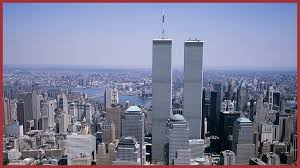

#  9/11 Bombers – A Fictional 2D Action Game

    
  <b>A fictional canvas-based action game inspired by post-9/11 themes of security and resilience.</b> 
  <i>Built using HTML5 Canvas and JavaScript</i>

  <a href="#about-the-game">About</a> •
  <a href="#features">Features</a> •
  <a href="#controls">Controls</a> •
  <a href="#how-to-play">How to Play</a> •
  <a href="#screenshots">Screenshots</a> •
  <a href="#tech-stack">Tech Stack</a> •
  <a href="#credits">Credits</a> •
  <a href="#disclaimer">Disclaimer</a> •
  <a href="#contact">Contact</a>

---

## 🕹️ About the Game

**Code 9/11** is a **2D action game** where you play as a fictional defender against growing threats in a city inspired by the post-9/11 era. The game draws symbolic inspiration from the themes of **terrorism, vigilance, and civilian safety**, presenting a fast-paced challenge in a fictional setting.

> 💡 This game is purely fictional and does not depict any real-world events or people.

---

## ✅ Features

- 🎮 Player movement and projectile mechanics (fireballs)
- 💥 Enemy collision and explosion animation
- ❤️ Health management and hit detection
- 🤖 Basic bot AI
- 📉 Score/health UI
- 🧱 Obstacles and environmental interactions
- 🔁 Game loop using `requestAnimationFrame`
- 🖥️ Canvas-based 2D graphics

---

## 🎯 Controls

| Key       | Action            |
|-----------|-------------------|
| click | destroy plane    |

---

## 🚀 How to Play

1. Open the live game [here](https://salman-ahmed-2.github.io/game-dev__9-11/)
2. **Click** to destroy planes.
3. Avoid enemies and obstacles. Survive as long as possible.
4. Defend the city, defeat bots, and stay alive!

---

## 📸 Screenshots

---

## 💻 Tech Stack

| Tool         | Purpose               |
|--------------|------------------------|
| HTML5        | Structure              |
| CSS3         | Basic styling          |
| JavaScript   | Game logic & rendering |
| Canvas API   | Graphics and animation |

---

## 🙌 Credits

- 🎮 Game Developer: [Salman Ahmed Khan](https://github.com/salman-ahmed-2)
- 🧠 Concept: Fictional action game symbolizing post-9/11 vigilance
- 🎨 Assets: Custom drawings and open-source/placeholder sprites

---

## ⚠️ Disclaimer

> This is a fictional, symbolic game created for **educational purposes** only.  
> It is **not intended to depict or recreate any real-world events**, and does not aim to glorify violence or disrespect victims of the 9/11 tragedy.  
> All characters and scenarios are fictional.

---

## 📬 Contact

- 📧 Email: [salmanahmed32121@gmail.com](mailto:salmanahmed32121@gmail.com)
- 🖥️ GitHub: [@salman-ahmed-2](https://github.com/salman-ahmed-2)
- 💼 LinkedIn: [Salman Ahmed Khan](https://www.linkedin.com/in/salman-ahmed-khan-843240226)

---

> © 2025 Salman Ahmed Khan — Code 9/11 Bombers
